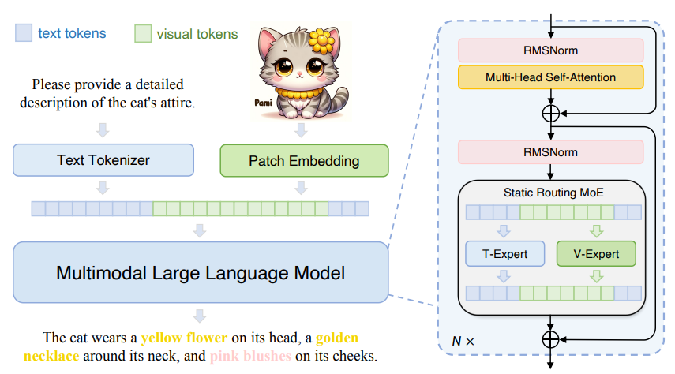

# MonoInternVLTuto

### How to run?

1. Create environment with python 3.10 (What I am using)
2. Intall torch and torchvision (with cuda support to run model inference on GPU) [Pytorch](https://pytorch.org/)
3. run `pip install -r requirements.txt`

You're good to go!
